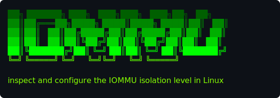

# iommu



Manage the Linux IOMMU substrate via the kernel command line.

The Linux IOMMU (Intel VT-d, AMD-Vi) sits between the CPU and PCI
devices, translating and isolating DMA. Userspace tools that talk to
PCI devices directly -- `vfio-pci` for VM passthrough, `vfio-pci` or
`uio_pci_generic` for DPDK / SPDK -- interact with the IOMMU substrate
differently depending on which mode the kernel was booted with.

`iommu` is a small CLI for inspecting the current mode and switching
between them. It rewrites the bootloader's kernel command line; the
change applies on the next boot.

## Modes

Three substrate modes, mutually exclusive.

### `off`

Tokens: `intel_iommu=off amd_iommu=off`

The IOMMU drivers don't load. No DMA isolation anywhere. `uio_pci_generic`
works freely; `vfio-pci` works only with the `enable_unsafe_noiommu_mode`
module knob (see [Modifiers](#modifiers) below). Zero overhead, zero
protection -- appropriate on trusted hardware or for development where
the IOMMU is undesirable.

### `strict`

Tokens: `intel_iommu=on amd_iommu=on`

The IOMMU drivers load and every DMA from every device is translated,
including host-owned devices. Maximum isolation; defends the host kernel
from malicious or buggy DMA. Highest per-DMA overhead. This is what
"IOMMU on" traditionally meant.

### `pt` (passthrough)

Tokens: `intel_iommu=on amd_iommu=on iommu=pt`

The IOMMU drivers load but host-owned devices skip translation (the
passthrough domain). Devices bound to `vfio-pci` get switched to an
isolated translating domain. Best of both worlds: native host
performance plus full vfio isolation for VM passthrough / SPDK / DPDK
workflows. The most common production configuration.

## Modifiers

Independent of the substrate mode, two further knobs sometimes apply:

### Unsafe interrupts (cmdline)

On platforms without Interrupt Remapping, `vfio-pci` passthrough refuses
to bind by default. Two tokens lift that restriction:

```
vfio_iommu_type1.allow_unsafe_interrupts=1
iommufd.allow_unsafe_interrupts=1
```

Only meaningful when combined with `strict` or `pt`. This tool does not
write them automatically today; they are listed here for awareness.

### Noiommu vfio (module config)

When the IOMMU is `off` but you still want to use `vfio-pci`, set this
in `/etc/modprobe.d/`:

```
options vfio enable_unsafe_noiommu_mode=Y
```

This is a vfio-module parameter, not a cmdline token, and lives outside
GRUB's domain. This tool does not write it today; the operator adds it
manually.

## What this tool does *not* control

- **iommufd vs legacy vfio groups.** Both APIs ride on top of the
  substrate modes above. On kernel 6.5+, `vfio-pci` exposes the legacy
  `/dev/vfio/<group>` container API *and* the iommufd cdev API at
  `/dev/vfio/devices/vfioN` (backed by `/dev/iommu`) simultaneously;
  whichever the userspace consumer asks for is what it gets. `iommu`
  doesn't pick.
- **`iommu.strict={0,1}`.** IOTLB-flush policy (lazy vs strict). An
  orthogonal perf-vs-isolation knob; modern x86 defaults to lazy.
- **Architecture-specific IOMMU drivers** beyond Intel VT-d / AMD-Vi
  (e.g. `arm-smmu`). Out of scope.

## Bootloader handling

`iommu set <mode>` auto-detects the bootloader manager and writes the
new cmdline:

- **`grubby`** (Fedora / RHEL): one `--update-kernel=ALL` invocation
  to add the target tokens, one to remove the others.
- **`/etc/default/grub` + `update-grub`** (Debian / Ubuntu): rewrites
  `GRUB_CMDLINE_LINUX` in place, then runs `update-grub`.

`--dry-run` shows the intended write without applying it -- runs as any
user, no root needed for the preview. The real write requires root
(reading `/proc/cmdline` for `show` does not).

## Install

```
pipx install iommu
```

Or from source:

```
git clone https://github.com/safl/iommu
cd iommu
make install         # pipx install -e . --force
```

## Usage

```
iommu                              # = iommu show (no-arg default)
iommu show                         # cmdline, mode, iommufd + vfio-cdev availability
iommu --dry-run set pt             # preview without writing GRUB
sudo iommu set pt && sudo reboot   # most common: IOMMU on, host passthrough
sudo iommu set strict              # IOMMU on, translating for all devices
sudo iommu set off                 # IOMMU disabled
```

`iommu show` sample output:

```
cmdline:   BOOT_IMAGE=... root=UUID=... intel_iommu=on amd_iommu=on iommu=pt ...
mode:      pt
iommufd:   available (/dev/iommu)
vfio-cdev: 0 device(s) at /dev/vfio/devices
```

## Related

- [`devbind`](https://github.com/xnvme/devbind) -- bind/unbind PCI
  devices to userspace drivers (vfio-pci, uio_pci_generic, native).
  Complementary: `iommu` sets the substrate, `devbind` binds devices.
- [`hugepages`](https://github.com/xnvme/hugepages) -- inspect and
  reserve Linux hugepages, the other half of the DPDK / SPDK pre-flight
  checklist.

## License

BSD-3-Clause.
